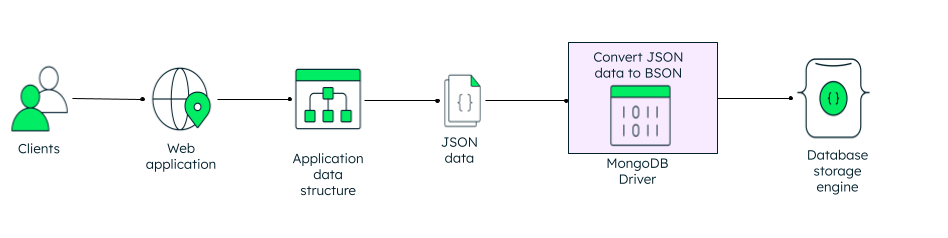

# MongoDB Practical Knowledge & Developer Guide

## 1. Introduction & Core Architecture

MongoDB is a document-oriented NoSQL database that stores data in flexible, semi-structured documents. Unlike relational databases with rigid schemas, MongoDB documents allow dynamic schemas where each document within a collection can contain different fields.

```text
Relational (RDBMS)          MongoDB (Document DB)
------------------          ---------------------
Database                    Database
Table                       Collection
Row / Record                Document
Column                      Field
Primary Key                 _id (ObjectId)
JOIN                        $lookup / Embedded Documents
```

### Hierarchy of Data
```text
MongoDB Server (mongod instance)
    └── Database (e.g., store_db)
            └── Collection (e.g., products, orders, customers)
                    └── Document (JSON/BSON object)
                            └── Field (Key-value pair)
```

---

## 2. BSON vs. JSON

While developers interact with MongoDB using standard **JSON** (JavaScript Object Notation), MongoDB internally stores and transmits data using **BSON** (Binary JSON).

### Why BSON?
| Feature | JSON | BSON |
| :--- | :--- | :--- |
| **Encoding** | Text-based (UTF-8 string) | Binary |
| **Storage Efficiency** | Human readable, but repetitive keys cause overhead | Optimized for fast parsing and traversal |
| **Data Types** | Limited: String, Number, Boolean, Array, Object, Null | Extended: Date, 32-bit Integer, 64-bit Integer, Decimal128, Binary data, ObjectId, Regular Expression |
| **Traversability** | Must parse whole text stream to locate a nested value | Contains length prefixes; fast skipping to specific fields |

#### JSON example
```JSON
{
  "_id": 1,
  "name": { "first" : "John", "last" : "Backus" },
  "contribs": [ "Fortran", "ALGOL", "Backus-Naur Form", "FP" ],
  "awards": [
    {
      "award": "W.W. McDowell Award",
      "year": 1967,
      "by": "IEEE Computer Society"
    }, {
      "award": "Draper Prize",
      "year": 1993,
      "by": "National Academy of Engineering"
    }
  ]
}
```

#### BSON Example 
```BSON
{"hello": "world"} →
\x16\x00\x00\x00           // total document size
\x02                       // 0x02 = type String
hello\x00                  // field name
\x06\x00\x00\x00world\x00  // field value
\x00                       // 0x00 = type EOO ('end of object')
 
{"BSON": ["awesome", 5.05, 1986]} →
\x31\x00\x00\x00
 \x04BSON\x00
 \x26\x00\x00\x00
 \x02\x30\x00\x08\x00\x00\x00awesome\x00
 \x01\x31\x00\x33\x33\x33\x33\x33\x33\x14\x40
 \x10\x32\x00\xc2\x07\x00\x00
 \x00
 \x00
```



### Essential BSON Data Types
- **`ObjectId`**: 12-byte unique identifier generated by default for `_id`:
  - 4-byte timestamp (seconds since Unix epoch)
  - 5-byte random value (machine + process specific)
  - 3-byte incrementing counter
- **`ISODate`**: 64-bit integer representing milliseconds since epoch (`ISODate("2026-09-14T18:00:00Z")`).
- **`NumberInt`**: 32-bit signed integer.
- **`NumberLong`**: 64-bit signed integer.
- **`NumberDecimal`**: 128-bit high-precision floating-point (crucial for financial calculations).

---

## 3. MongoDB Shell (`mongosh`) Quick Reference

Connect to your local MongoDB instance:
```bash
mongosh "mongodb://localhost:27017"
```

Common administrative commands:
```javascript
// Display all databases
show dbs

// Switch to (or create) a database
use store_db

// Show all collections in current database
show collections

// Explicitly create a collection
db.createCollection("products")

// Drop a collection
db.products.drop()

// Drop current database
db.dropDatabase()
```

---

## 4. In-Depth CRUD Operations

### 4.1 Create (Insert)

#### `insertOne()`
Inserts a single document. If `_id` is omitted, MongoDB automatically generates an `ObjectId`.
```javascript
db.products.insertOne({
  name: "Ultra Wireless Mouse",
  category: "Electronics",
  price: 49.99,
  stock: 120,
  tags: ["wireless", "accessory", "office"],
  specifications: {
    dpi: 4000,
    battery: "Rechargeable",
    weight_grams: 95
  },
  createdAt: new Date()
});
```

#### `insertMany()`
Inserts an array of documents.
```javascript
db.products.insertMany([
  {
    name: "Mechanical Keyboard",
    category: "Electronics",
    price: 119.99,
    stock: 45,
    tags: ["gaming", "mechanical", "rgb"]
  },
  {
    name: "Ergonomic Office Chair",
    category: "Furniture",
    price: 289.00,
    stock: 15,
    tags: ["office", "ergonomic"]
  }
], { ordered: true }); // If ordered is true, stops on first failure; if false, continues inserting remaining docs
```

---

### 4.2 Read (Query)

The general syntax for querying is:
```javascript
db.collection.find(queryCriteria, projection)
```

#### Comparison Operators
| Operator | Meaning | Example |
| :--- | :--- | :--- |
| `$eq` | Equal to | `db.products.find({ category: { $eq: "Electronics" } })` (or `{ category: "Electronics" }`) |
| `$ne` | Not equal to | `db.products.find({ category: { $ne: "Furniture" } })` |
| `$gt` / `$gte` | Greater than / Greater than or equal to | `db.products.find({ price: { $gte: 50 } })` |
| `$lt` / `$lte` | Less than / Less than or equal to | `db.products.find({ price: { $lt: 100 } })` |
| `$in` | Matches any value in an array | `db.products.find({ category: { $in: ["Electronics", "Computers"] } })` |
| `$nin` | Does not match any value in array | `db.products.find({ category: { $nin: ["Furniture", "Books"] } })` |

#### Logical Operators
- **`$and`**: Joins query clauses with a logical AND.
  ```javascript
  db.products.find({
    $and: [
      { category: "Electronics" },
      { price: { $lte: 100 } }
    ]
  })
  ```
- **`$or`**: Joins query clauses with a logical OR.
  ```javascript
  db.products.find({
    $or: [
      { category: "Furniture" },
      { price: { $gte: 200 } }
    ]
  })
  ```
- **`$not`**: Inverts the effect of a query expression.
  ```javascript
  db.products.find({ price: { $not: { $gt: 100 } } })
  ```

#### Querying Nested Documents and Arrays
- **Dot Notation for embedded fields**:
  ```javascript
  // Find products with dpi >= 3000 inside specifications object
  db.products.find({ "specifications.dpi": { $gte: 3000 } })
  ```
- **Array matching**:
  ```javascript
  // Matches documents where tags array contains "office"
  db.products.find({ tags: "office" })

  // Matches documents where tags contains BOTH "wireless" and "accessory"
  db.products.find({ tags: { $all: ["wireless", "accessory"] } })

  // Matches exact array length
  db.products.find({ tags: { $size: 3 } })
  ```

#### Projections (Selecting Specific Fields)
Projection specifies which fields to return (`1` to include, `0` to exclude):
```javascript
// Return only name and price; suppress _id
db.products.find(
  { category: "Electronics" },
  { name: 1, price: 1, _id: 0 }
)
```

#### Sorting, Skipping, and Limiting (Pagination)
```javascript
// Sort by price descending (-1) or ascending (1), skip first 10, return next 5
db.products.find()
  .sort({ price: -1 })
  .skip(10)
  .limit(5)
```

---

### 4.3 Update

#### Update Methods
- `db.collection.updateOne(filter, update, options)`
- `db.collection.updateMany(filter, update, options)`
- `db.collection.replaceOne(filter, replacementDocument)`

#### Critical Field Update Operators
| Operator | Description | Example |
| :--- | :--- | :--- |
| **`$set`** | Sets or creates the value of a field | `db.products.updateOne({ name: "Mechanical Keyboard" }, { $set: { price: 109.99, onSale: true } })` |
| **`$unset`** | Deletes a specified field from document | `db.products.updateOne({ name: "Mechanical Keyboard" }, { $unset: { onSale: "" } })` |
| **`$inc`** | Increments or decrements a numeric field | `db.products.updateOne({ name: "Mechanical Keyboard" }, { $inc: { stock: -1 } })` |
| **`$mul`** | Multiplies value of a field | `db.products.updateMany({}, { $mul: { price: 1.05 } })` (5% price hike) |
| **`$min` / `$max`** | Updates only if new value is lower/higher | `db.products.updateOne({ name: "Mechanical Keyboard" }, { $min: { lowestPrice: 99.00 } })` |

#### Array Update Operators
- **`$push`**: Appends an element to an array.
  ```javascript
  db.products.updateOne(
    { name: "Ultra Wireless Mouse" },
    { $push: { tags: "bluetooth" } }
  )
  ```
- **`$addToSet`**: Adds an element to an array only if it does not already exist (avoids duplicates).
  ```javascript
  db.products.updateOne(
    { name: "Ultra Wireless Mouse" },
    { $addToSet: { tags: "office" } }
  )
  ```
- **`$pull`**: Removes all matching elements from an array.
  ```javascript
  db.products.updateOne(
    { name: "Ultra Wireless Mouse" },
    { $pull: { tags: "bluetooth" } }
  )
  ```

#### The `upsert` Option
If `upsert: true` is passed, MongoDB will update the document if found, or insert a new document if no match exists.
```javascript
db.products.updateOne(
  { sku: "SKU-9901" },
  { $set: { name: "USB-C Hub", price: 29.99, stock: 50 } },
  { upsert: true }
)
```

---

### 4.4 Delete

```javascript
// Delete a single matching document
db.products.deleteOne({ name: "Ultra Wireless Mouse" })

// Delete all documents matching condition
db.products.deleteMany({ stock: { $lte: 0 } })

// Delete ALL documents in a collection (collection remains intact)
db.products.deleteMany({})
```

---

## 5. The Aggregation Framework

The Aggregation Framework processes data records and returns computed results using a **pipeline** concept. Documents pass through a multi-stage sequence where each stage transforms the documents.

```text
Collection ──► $match ──► $group ──► $project ──► $sort ──► Final Result
```

### Essential Pipeline Stages

1. **`$match`**: Filters documents (similar to SQL `WHERE`). Placed early to reduce pipeline volume.
2. **`$group`**: Groups documents by a specified identifier and applies accumulator expressions (similar to SQL `GROUP BY`).
3. **`$project`**: Reshapes documents, computes new fields, or suppresses fields (similar to SQL `SELECT`).
4. **`$sort`**: Reorders documents by specified field(s) (similar to SQL `ORDER BY`).
5. **`$limit` & `$skip`**: Restricts the count of output documents.
6. **`$unwind`**: Deconstructs an array field from input documents to output a document for each array element.
7. **`$lookup`**: Performs a left outer join to an unsharded collection in the same database.

### Common Accumulators in `$group`
- `$sum`: Calculates the sum or counts items (`{ $sum: 1 }`).
- `$avg`: Calculates the mathematical mean.
- `$min` / `$max`: Finds the lowest or highest value.
- `$push`: Collects values into an array.
- `$addToSet`: Collects unique values into a set/array.

### Practical Aggregation Example
Suppose we want to find total inventory value and average product price grouped by category for items costing more than $20:

```javascript
db.products.aggregate([
  // Stage 1: Filter out cheap products
  {
    $match: {
      price: { $gte: 20 }
    }
  },
  // Stage 2: Group by category and compute metrics
  {
    $group: {
      _id: "$category",
      totalProducts: { $sum: 1 },
      avgPrice: { $avg: "$price" },
      totalStock: { $sum: "$stock" },
      totalInventoryValue: { $sum: { $multiply: ["$price", "$stock"] } }
    }
  },
  // Stage 3: Reshape output
  {
    $project: {
      _id: 0,
      category: "$_id",
      totalProducts: 1,
      avgPrice: { $round: ["$avgPrice", 2] },
      totalStock: 1,
      totalInventoryValue: { $round: ["$totalInventoryValue", 2] }
    }
  },
  // Stage 4: Sort by total inventory value descending
  {
    $sort: { totalInventoryValue: -1 }
  }
])
```

---

## 6. Indexing & Query Performance

Without indexes, MongoDB must perform a **collection scan** (`COLLSCAN`) by examining every single document in the collection to fulfill a query. An **index scan** (`IXSCAN`) uses a B-tree data structure for logarithmic `O(log N)` search time.

### Index Types
1. **Default Index**: Automatically created on `_id` as unique.
2. **Single Field Index**:
   ```javascript
   db.products.createIndex({ category: 1 }) // 1 = Ascending, -1 = Descending
   ```
3. **Compound Index**: Multiple fields indexed together. Follow the **ESR Rule** (Equality, Sort, Range):
   ```javascript
   db.products.createIndex({ category: 1, price: -1 })
   ```
4. **Multikey Index**: Automatically created when an indexed field contains an array (e.g., `tags`):
   ```javascript
   db.products.createIndex({ tags: 1 })
   ```
5. **Unique Index**: Enforces that no two documents have the same indexed value:
   ```javascript
   db.products.createIndex({ sku: 1 }, { unique: true })
   ```
6. **TTL (Time to Live) Index**: Automatically deletes documents after a specified number of seconds:
   ```javascript
   db.sessions.createIndex({ createdAt: 1 }, { expireAfterSeconds: 3600 })
   ```

### Managing & Inspecting Indexes
```javascript
// List all indexes on collection
db.products.getIndexes()

// Drop a specific index
db.products.dropIndex("category_1")

// Analyze query performance using explain
db.products.find({ category: "Electronics", price: { $gt: 50 } })
  .explain("executionStats")
```
Look for:
- `stage`: `IXSCAN` (Good) vs. `COLLSCAN` (Needs index!)
- `totalDocsExamined`: Ideal if equal or close to `nReturned`.

---

## 7. MongoDB vs. Azure Cosmos DB API for MongoDB

Azure Cosmos DB provides wire-protocol compatibility for MongoDB. This means you can use your existing MongoDB drivers, SDKs (Mongoose, PyMongo, MongoDB Node.js driver), and tools (Compass, `mongosh`) to connect to Azure Cosmos DB without rewriting your application code.

### Architectural Comparison
| Feature | Native MongoDB (Community / Atlas) | Azure Cosmos DB API for MongoDB |
| :--- | :--- | :--- |
| **Compute / Storage Coupling** | Typically provisioned as dedicated replica sets/nodes | Disaggregated compute and storage; instant elastic scale |
| **Capacity Unit** | CPU cores, RAM, Disk IOPS | Request Units (RU/s) or vCore architecture |
| **Multi-Region Writes** | Requires complex multi-cluster replication | Turnkey native active-active multi-region writes with SLA |
| **SLA** | Varies by hosting provider / Atlas tier | 99.999% High Availability, single-digit millisecond latency SLAs |
| **Partitioning** | Shard keys with config servers & mongos routers | Automatic horizontal partitioning managed transparently |
