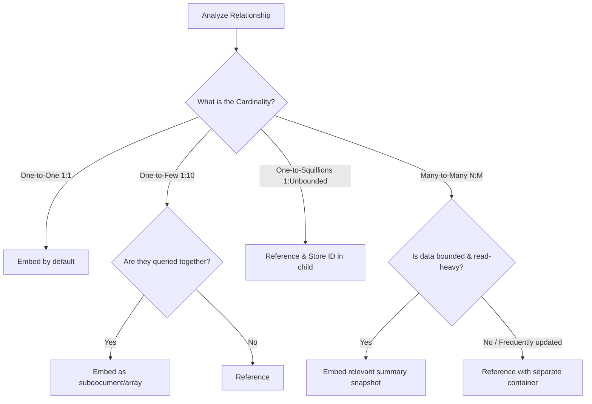

# Day 4: NoSQL Data Modeling & Partitioning Mastery

Designing databases in NoSQL requires a complete mindset shift from traditional Relational Database Management Systems (RDBMS). In SQL databases like PostgreSQL or Microsoft SQL Server, you design schemas around the **entities** and **normalize** data to eliminate redundancy. In NoSQL systems like Azure Cosmos DB and MongoDB, you design models around the **application's read/write access patterns** and **denormalize** data for distributed horizontal scale.

---

## 1. RDBMS Normalization vs. NoSQL Denormalization

### Relational Mindset (3rd Normal Form - 3NF)
- **Goal**: Minimize storage space and eliminate duplicate data.
- **Mechanism**: Split data across dozens of normalized tables connected by Foreign Keys.
- **Cost**: Queries require expensive runtime `JOIN` operations. In a distributed multi-node cloud database, cross-node joins require network latency, serialization bottlenecks, and massive computational overhead.

```text
Relational (Normalized):
[Customers Table] ──(FK)──> [Orders Table] ──(FK)──> [OrderItems Table] ──(FK)──> [Products Table]
* Reading an order requires 4 table JOINs *
```

### NoSQL Document Mindset (Denormalized)
- **Goal**: Optimize for read and write performance, minimal latency, and horizontal scalability.
- **Mechanism**: Store related data together within a single document (JSON), matching how the application naturally consumes the object.
- **Cost**: Storage redundancy is accepted as a trade-off for single-digit millisecond latency reads and zero cross-server joins.

```text
NoSQL (Document-Centric):
{
  "orderId": "ORD-2024-001",
  "customer": { "id": "CUST-001", "name": "Sarah Connor" },
  "items": [
    { "productId": "PROD-101", "name": "Headphones", "unitPrice": 299.99, "qty": 1 }
  ]
}
* Reading an order requires fetching a single document from a single partition *
```

---

## 2. Embedding vs. Referencing

When modeling relationships between entities in document databases, you have two primary strategies: **Embedding** (nested objects/arrays) and **Referencing** (storing document IDs).

| Feature | Embedding (Denormalization) | Referencing (Normalization) |
| :--- | :--- | :--- |
| **How it works** | Related data is nested inside the document | Only the ID/Foreign Key is stored in the document |
| **Read Cost** | Lowest (1 read fetches all related data) | Higher (Requires multiple queries or client-side joins) |
| **Write/Update Cost**| Higher if duplicate data must be synchronized | Lowest (Update in one master record only) |
| **Document Size** | Risk of exceeding document size limits | Keeps documents lean and uniform |
| **Concurrency** | Updates can cause optimistic concurrency collisions | Isolated updates on distinct entities |

---

### Decision Framework: When to Embed vs. When to Reference



#### Rule 1: One-to-One (1:1) Relationships ➔ **EMBED**
* **Example**: A `Customer` and their `BillingAddress` or `ProfilePreferences`.
* Since address is almost always loaded alongside the customer, embed it:
  ```json
  {
    "id": "CUST-001",
    "name": "Sarah Connor",
    "address": {
      "street": "742 Evergreen Terrace",
      "city": "Toronto",
      "province": "ON"
    }
  }
  ```

#### Rule 2: One-to-Few (1:Few) Relationships ➔ **EMBED**
* **Example**: An `Order` and its `LineItems` (orders rarely exceed 50 items).
* An order is immutable once placed, and you always view line items with the order.
* **Never create a separate collection/container for order line items in NoSQL.**

#### Rule 3: One-to-Many Unbounded (1:Squillions) ➔ **REFERENCE**
* **Example**: A `Sensor` and its `TelemetryReadings`, or a `YouTuber` and their `Comments`.
* In MongoDB, the document limit is **16 MB**. In Azure Cosmos DB, the item limit is **2 MB**.
* If you embed infinite child records into an array:
  1. The document will eventually hit the 2 MB / 16 MB limit and crash.
  2. Modifying or appending to a 1.9 MB document consumes massive RU/s or write bandwidth.
* **Pattern**: Store the `sensorId` or `videoId` on the child document:
  ```json
  {
    "id": "READING-994821",
    "sensorId": "SENSOR-ALPHA-01",
    "temperature": 23.4,
    "timestamp": "2024-03-22T10:00:00Z"
  }
  ```

#### Rule 4: Many-to-Many (N:M) Relationships ➔ **HYBRID SNAPSHOT**
* **Example**: `Products` and `Tags` or `Students` and `Courses`.
* If data is read-heavy and rarely changes, denormalize a **snapshot**:
  * In the `Order` document, store `productName` and `unitPriceAtPurchase` directly in the item array.
  * Why? Even if the product master record changes price next month, historical orders must preserve the price paid at the time of purchase!

---

## 3. Partitioning Architecture in Azure Cosmos DB

Partitioning is the fundamental mechanism that allows Azure Cosmos DB to scale infinitely in both storage and throughput.

```text
┌────────────────────────────────────────────────────────────────────────┐
│                        Cosmos DB Container                             │
└──────────────────────────────────┬─────────────────────────────────────┘
                                   │
         ┌─────────────────────────┴─────────────────────────┐
         ▼                                                   ▼
┌─────────────────────────────────┐         ┌─────────────────────────────────┐
│       Physical Partition 1      │         │       Physical Partition 2      │
│  (Up to 50 GB storage, 10k RU/s)│         │  (Up to 50 GB storage, 10k RU/s)│
│ ┌─────────────┐ ┌─────────────┐ │         │ ┌─────────────┐ ┌─────────────┐ │
│ │ Logical P1  │ │ Logical P2  │ │         │ │ Logical P3  │ │ Logical P4  │ │
│ │ (/dept="HR")│ │(/dept="Sales│ │         │ │(/dept="Eng")│ │(/dept="Mktg)│ │
│ └─────────────┘ └─────────────┘ │         │ └─────────────┘ └─────────────┘ │
└─────────────────────────────────┘         └─────────────────────────────────┘
```

### Physical Partitions vs. Logical Partitions

| Attribute | Logical Partition | Physical Partition |
| :--- | :--- | :--- |
| **Defined By** | The value of your chosen **Partition Key** (e.g., `customerId = "CUST-001"`) | Internal Azure SSD storage cluster and compute slice |
| **Managed By** | Your data and data model | Completely managed and scaled by Azure automatically |
| **Maximum Storage Limit** | **20 GB** per logical partition | **50 GB** per physical partition |
| **Maximum Throughput Limit**| Up to the physical partition cap | **10,000 RU/s** max per physical partition |
| **Number of Partitions** | Virtually infinite | Dynamically provisioned based on total storage & RU/s |

> [!IMPORTANT]
> **The 20 GB Rule**: No single logical partition key value can ever exceed 20 GB of storage. If you choose a partition key with low cardinality (e.g., `gender`, `status="active"`), all documents sharing that value will fill the 20 GB partition, throwing an error and halting writes!

---

## 4. How to Choose the Optimal Partition Key

Your choice of Partition Key is the **single most important design decision** in Azure Cosmos DB. You cannot change the partition key of an existing container after creation (you would have to migrate data to a new container).

### The Three Golden Rules for Partition Keys:

1. **High Cardinality**:
   * It must have thousands or millions of possible distinct values (e.g., `userId`, `tenantId`, `deviceId`, `orderId`).
   * *Bad*: `gender` (2 values), `isDelivered` (true/false), `countryCode` (only ~200 values).

2. **Even Distribution of Storage**:
   * Data volume must be evenly dispersed across partition values so that no single partition approaches 20 GB while others are empty.

3. **Even Distribution of Throughput (No "Hot Partitions")**:
   * Read and write requests should be uniformly spread across partitions. If 90% of your users hit documents under `partitionKey="promo_today"`, that single physical partition will throttle (HTTP 429) while your other partitions sit completely idle!

```text
❌ BAD: Hot Partition (Bottleneck)
Partition Key: /status
┌──────────────────┐  ┌──────────────────┐
│ status: "active" │  │status: "archived"│
│  98% of Traffic  │  │  2% of Traffic   │
│   🔥🔥🔥🔥🔥      │  │     ❄️❄️❄️       │
│  THROTTLED (429) │  │  Wasted RU/s     │
└──────────────────┘  └──────────────────┘

✅ GOOD: Uniform Distribution
Partition Key: /customerId
┌──────────────┐  ┌──────────────┐  ┌──────────────┐  ┌──────────────┐
│  /CUST-001   │  │  /CUST-002   │  │  /CUST-003   │  │  /CUST-004   │
│ 25% Traffic  │  │ 25% Traffic  │  │ 25% Traffic  │  │ 25% Traffic  │
│  Balanced    │  │  Balanced    │  │  Balanced    │  │  Balanced    │
└──────────────┘  └──────────────┘  └──────────────┘  └──────────────┘
```

---

## 5. Synthetic Partition Keys

What happens when your document doesn't have a single property with both high cardinality and uniform access? You construct a **Synthetic Partition Key**.

### Strategy A: Concatenating Multiple Fields
Combine two or more properties to create a unique compound key.
* **Scenario**: Tracking telemetry events where `deviceId` has high traffic bursts on specific dates.
* **Synthetic Key**: `deviceId_date`
  * Example: `"deviceId_date": "DEV104_20240322"`
  * Allows querying all events for a device on a single day within one logical partition.

### Strategy B: Random Suffixing (Write-Heavy Ingestion)
When thousands of items per second share the same property value (e.g., a massive flash sale or Black Friday event):
* Append a random number (e.g., 1 to 10) to the key.
* Property: `"partitionKey": "order_20241125_" + Math.floor(Math.random() * 10)`
* Result: Writes are distributed across 10 distinct physical partitions, multiplying your maximum ingestion write throughput 10x!

### Strategy C: Pre-calculated Hash Prefixing
* Prefix a property with a deterministic hash so that queries starting with similar characters don't cluster on the same physical range.

---

## 6. Query Economics: Single-Partition vs. Cross-Partition Queries

When designing your model and partition key, always ask: **What are my top 3 most frequent queries?**

```text
Point Read (id + pk):
App ──────────────Direct Lookup─────────────> [Target Partition]  ==> ~1.0 RU (1 ms)

Single-Partition Query:
App ─────WHERE pk = 'CUST-001' AND ...──────> [Target Partition]  ==> ~2.5 - 5.0 RUs

Cross-Partition Query (Fan-Out):
App ─────WHERE status = 'Processing'────────> [Partition 1]
                                     └──────> [Partition 2]       ==> 40 - 200+ RUs
                                     └──────> [Partition 3]
```

### Cost Comparison:
1. **Point Read (`ReadItemAsync` with `id` and `partitionKey`)**:
   * Reads 1 KB item directly by memory address.
   * **Cost**: **1.0 RU** (Single-digit millisecond latency). The fastest and cheapest operation possible.
2. **Single-Partition Query (Includes partition key in `WHERE` clause)**:
   * Cosmos DB routes the query directly to that specific physical partition.
   * **Cost**: Low (typically 2 to 5 RUs).
3. **Cross-Partition Query (Omits partition key in `WHERE` clause)**:
   * Cosmos DB must "fan out" the query to **every physical partition in the container** in parallel and merge the results.
   * **Cost**: High RU consumption and higher latency. If you have 50 physical partitions, a fan-out query runs 50 separate subqueries!

---

## 7. Key Takeaways for DSAI Engineers

1. **Model for access patterns, not entity normalization**: Embed if entities are read together and bounded; reference if relationships are unbounded (1:many) or write-heavy.
2. **Cardinality is king**: Always pick partition keys with high numbers of distinct values.
3. **Guard against hot partitions**: Never pick low-cardinality keys like status, gender, or single department codes.
4. **Target point reads and single-partition queries**: Whenever possible, include the partition key in your lookup filters to keep RU costs low and latency minimal.
